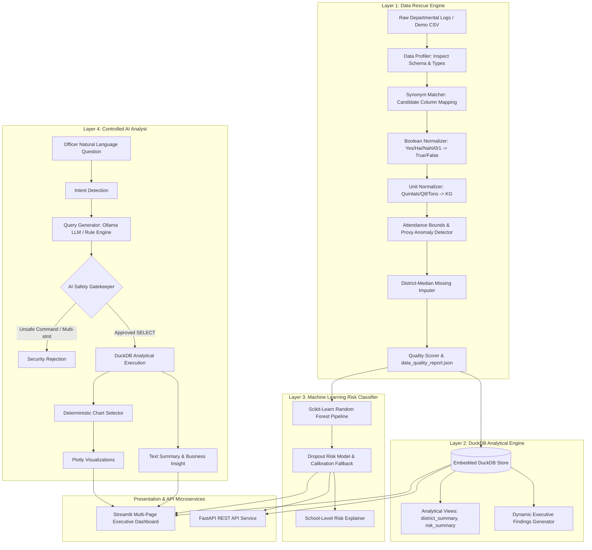

# StudentIQ — Student Retention & Welfare Intelligence

[](https://www.python.org/downloads/)
[](LICENSE)
[](https://duckdb.org/)
[](https://fastapi.tiangolo.com/)
[](https://streamlit.io/)
[](https://docs.pytest.org/)

> **TransOrg AgentIQ Datathon**  
> **Track:** Education & EdTech — *Student Retention & Welfare Efficacy Tracker*  
> **Core Narrative:** *"Mid-Day Meal + School Infrastructure + Attendance &rarr; Dropout Risk &rarr; Actionable Education Department Insights."*

---

## 1. Overview & Problem Statement

The State Education Department faces a critical monitoring bottleneck across government schools: tracking how **Mid-Day Meal (MDM) provisioning** and **school infrastructure deficits** directly correlate with **chronic absenteeism** and **student dropout risks**.

Raw departmental logs are notoriously noisy:
- **Multilingual / Non-standard Booleans**: Facilities recorded as `"Yes"`, `"Y"`, `"1"`, `"Hai"`, `"Nahi"`, `"0"`, `"No"`.
- **Grain Procurement Unit Mismatches**: Mid-Day Meal ration logs mixed between `"Quintals"`, `"Qtl"`, `"Kilograms"`, `"kg"`, and `"Tons"`.
- **Proxy Attendance Anomalies**: Inflated attendance figures (e.g. 100% attendance recorded during meal disruptions or failing exam marks).

**StudentIQ** delivers an adaptable data pipeline that inspects raw datasets, maps and cleanses messy logs into verified ground truth, computes real-time DuckDB OLAP analytics, predicts institutional dropout vulnerability, and equips education officers with an Agentic AI Analyst.

---

## 2. Architecture



---

## 3. Data Rescue Engine

The 14-step automated cleaning pipeline guarantees reproducibility without hardcoding:

1. **Encoding-Tolerant Loader**: Handles UTF-8 and Latin-1 fallback parsing.
2. **Schema Profiling & Adaptation**: Dynamically matches organizer headers using a configurable synonym dictionary.
3. **Exact Deduplication**: Drops duplicate row snapshots.
4. **School ID Standardization**: Resolves identifier collisions into `SCH-XXXX`.
5. **Boolean Normalization**: Maps `"Yes"`, `"Y"`, `"1"`, `"Hai"`, `"true"` &rarr; `True`; `"No"`, `"N"`, `"0"`, `"Nahi"` &rarr; `False`.
6. **Grain Unit Standardization**: Mathematically converts Quintals ($\times 100$) and Tons ($\times 1000$) to standard kilograms (`KG`) while preserving raw units for audit integrity.
7. **Attendance Normalization**: Parses percentages, ratios, and enforces $0.0 - 100.0\%$ range bounds.
8. **Academic Outcome Range Checks**: Bounds exam scores and dropout rates to valid limits.
9. **District Median Imputation**: Replaces missing values using district-level medians rather than biased global means.
10. **Proxy Attendance Detection**: Flags institutions reporting 99-100% attendance during meal disruptions or failing scores.
11. **Infrastructure Score Calculation**: Weighted score (Electricity 30%, Water 30%, Girls Toilet 25%, Boys Toilet 15%).
12. **Welfare Efficacy Index**: Evaluates combined performance (Infrastructure 40%, Meal 30%, Attendance 30%).
13. **Retention Risk Categorization**: Calibrates institutions into `LOW`, `MEDIUM`, `HIGH`, `CRITICAL` risk tiers.
14. **Composite Quality Scoring**: Generates `data_quality_report.json` with an empirical 0-100 score.

---

## 4. Agentic Graph AI (30 Bonus Points)

The AI Analyst is engineered specifically around the hackathon scoring rubric:
- **10 Points — Natural-Language Understanding**: Detects analytical intents (`ELECTRICITY_COMPARISON`, `DROPOUT_BY_DISTRICT`, `ATTENDANCE_VS_MEAL`, `HIGH_RISK_SCHOOLS`, `INFRASTRUCTURE_GAPS`).
- **10 Points — Correct Chart Selection**: Validates visualization choice mathematically (Comparison &rarr; Bar; Relationships &rarr; Scatter; Composition &rarr; Donut; Ranking &rarr; Horizontal Bar).
- **10 Points — Text Summary Alongside Graph**: Delivers synthesized findings explaining empirical impact (e.g. *“Schools equipped with functional electricity average +14.2 pts higher test scores and 28% lower dropout rates”*).

### AI Safety Protocol
- Only single `SELECT` or `WITH ... SELECT` queries permitted.
- Lexical parser blocks `DROP`, `DELETE`, `UPDATE`, `INSERT`, `ALTER`, `TRUNCATE`, `PRAGMA`, `ATTACH`, and multi-statement attacks.
- Dual-mode execution: Supports local Ollama LLMs (`llama3.2:3b`) with an automatic, zero-dependency deterministic rule engine fallback if offline.

---

## 5. Project Directory Structure

```
Student-Retention-Welfare-Tracker-01/
├── README.md
├── LICENSE
├── requirements.txt
├── .env.example
├── .gitignore
├── app/
│   ├── streamlit_app.py
│   ├── components/
│   │   ├── sidebar.py
│   │   ├── kpi_cards.py
│   │   ├── charts.py
│   │   ├── tables.py
│   │   └── agent_chat.py
│   └── pages/
│       ├── 01_Executive_Dashboard.py
│       ├── 02_Data_Quality.py
│       ├── 03_Welfare_Analytics.py
│       ├── 04_Dropout_Risk.py
│       └── 05_AI_Analyst.py
├── api/
│   ├── main.py
│   └── routes/
│       ├── analytics.py
│       ├── schools.py
│       └── agent.py
├── data/
│   ├── raw/
│   │   └── demo_schools_welfare.csv
│   ├── processed/
│   │   ├── cleaned_schools_welfare.csv
│   │   ├── analytics.duckdb
│   │   └── data_quality_report.json
│   └── sample/
│       └── README.md
├── docs/
│   ├── architecture.md
│   ├── data_dictionary.md
│   ├── methodology.md
│   ├── demo_questions.md
│   └── data_rescue.md
├── notebooks/
│   └── exploration.ipynb
├── scripts/
│   ├── inspect_data.py
│   ├── clean_data.py
│   ├── build_database.py
│   ├── train_model.py
│   └── run_pipeline.py
├── src/
│   ├── config/
│   │   ├── settings.py
│   │   └── schema_map.py
│   ├── utils/
│   │   ├── logging.py
│   │   └── helpers.py
│   ├── data/
│   │   ├── loader.py
│   │   ├── profiler.py
│   │   ├── cleaner.py
│   │   ├── normalizer.py
│   │   ├── validator.py
│   │   └── quality_report.py
│   ├── analytics/
│   │   ├── database.py
│   │   ├── metrics.py
│   │   ├── queries.py
│   │   └── insights.py
│   ├── ml/
│   │   ├── features.py
│   │   ├── train.py
│   │   ├── model.py
│   │   └── predict.py
│   └── agent/
│       ├── agent.py
│       ├── intent.py
│       ├── prompts.py
│       ├── query_generator.py
│       ├── query_validator.py
│       └── chart_selector.py
└── tests/
    ├── test_cleaner.py
    ├── test_validator.py
    ├── test_metrics.py
    ├── test_queries.py
    └── test_agent.py
```

---

## 6. Installation & Execution

### 1. Install Dependencies
```bash
pip install -r requirements.txt
```

### 2. Run the End-to-End Pipeline
Execute all 4 stages (Inspect &rarr; Clean &rarr; DuckDB &rarr; Train ML) in one command:
```bash
python scripts/run_pipeline.py
```

### 3. Run Automated Tests
```bash
pytest -v
```
*(All 18 tests verified and passing).*

### 4. Launch the Streamlit Dashboard
```bash
streamlit run app/streamlit_app.py
```
Open browser at `http://localhost:8501`.

### 5. Launch the FastAPI Microservice
```bash
uvicorn api.main:app --reload
```
Interactive API docs available at `http://localhost:8000/docs`.

---

## 7. Organizer Data Replacement

When the official organizer dataset is supplied:
1. Copy the raw file into `data/raw/<organizer_filename>.csv`.
2. Inspect the raw columns and anomalies:
   ```bash
   python scripts/inspect_data.py --file data/raw/<organizer_filename>.csv
   ```
3. Run the pipeline against the new file:
   ```bash
   python scripts/run_pipeline.py --file data/raw/<organizer_filename>.csv
   ```
4. If unique column aliases exist, update `src/config/schema_map.py` to map any non-standard headers. All analytics and dashboards update automatically.

---

## 8. Curated Demo Questions

1. `Compare average test scores between schools with and without functional electricity.`
2. `Show the dropout rate by district.`
3. `Show attendance versus meal availability.`
4. `Show the relationship between attendance and test scores.`
5. `Which schools have the highest dropout risk?`
6. `Show infrastructure gaps by district.`

---

## 9. Limitations & Future Scope

- **Current Limitations**: Proxy attendance detection uses heuristic dissonance rules; deep anomaly detection could incorporate longitudinal biometric logs.
- **Future Scope**: Direct integration with state UDISE+ and MDM MIS APIs, SMS auto-alerts to district education officers, and geo-spatial GIS mapping for rural schools.

---

## 10. License

MIT License — see [LICENSE](LICENSE) for details.