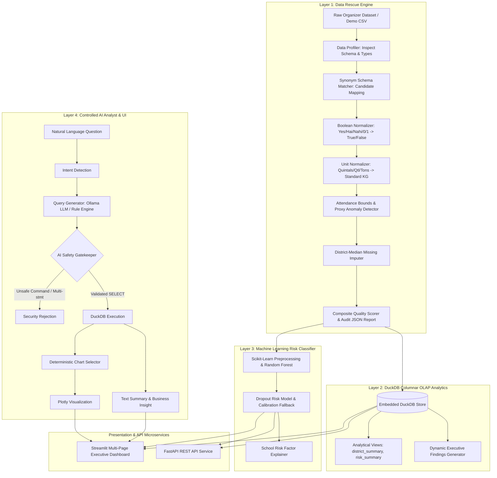

# StudentIQ Architectural Blueprint

StudentIQ is architected to address the official **TransOrg AgentIQ Datathon** business challenge for the **Education & EdTech Track: "Student Retention & Welfare Efficacy Tracker"**.

## Core Problem Statement
The State Education Department needs to monitor and evaluate the correlation between:
1. Mid-Day Meal scheme
2. School infrastructure
3. Student dropout risks

## 4-Layer Architecture

## Adaptability Guarantee
When the organizer dataset arrives:
1. Copy raw file into `data/raw/`
2. Run `python scripts/inspect_data.py --file data/raw/<file>.csv`
3. Run `python scripts/run_pipeline.py --file data/raw/<file>.csv`
The fuzzy schema matcher automatically detects column aliases and regenerates clean ground truth without touching UI or backend code.